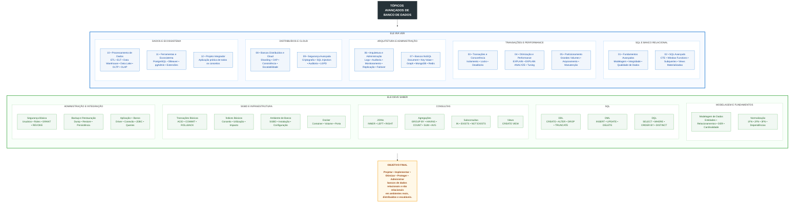

# Mapa Curricular: Tópicos Avançados de Banco de Dados

```mermaid
flowchart TB

    %% =========================================================
    %% ESTILOS
    %% =========================================================

    classDef title fill:#263238,stroke:#263238,color:#FFFFFF,stroke-width:2px,font-weight:bold,font-size:20px;
    classDef prereq fill:#F1F8F3,stroke:#4CAF50,color:#1B5E20,stroke-width:1px;
    classDef advanced fill:#F1F6FC,stroke:#1976D2,color:#0D47A1,stroke-width:1px;
    classDef objective fill:#FFF8E8,stroke:#F59E0B,color:#92400E,stroke-width:2px,font-weight:bold;

    %% =========================================================
    %% TÍTULO
    %% =========================================================

    TITULO["TÓPICOS AVANÇADOS DE BANCO DE DADOS"]:::title

    %% =========================================================
    %% ÁREA PRINCIPAL
    %% =========================================================

    subgraph MAPA[" "]
        direction LR

        %% =====================================================
        %% PRÉ-REQUISITOS
        %% =====================================================

        subgraph PRE["ELE DEVE SABER"]
            direction TB

            subgraph PRE1["MODELAGEM E FUNDAMENTOS"]
                direction TB
                P1["Modelagem de Dados<br/>Entidades • Relacionamentos • DER • Cardinalidade"]:::prereq
                P2["Normalização<br/>1FN • 2FN • 3FN • Dependências"]:::prereq
            end

            subgraph PRE2["SQL"]
                direction TB
                P3["DDL<br/>CREATE • ALTER • DROP • TRUNCATE"]:::prereq
                P4["DML<br/>INSERT • UPDATE • DELETE"]:::prereq
                P5["DQL<br/>SELECT • WHERE • ORDER BY • DISTINCT"]:::prereq
            end

            subgraph PRE3["CONSULTAS"]
                direction TB
                P6["JOINs<br/>INNER • LEFT • RIGHT"]:::prereq
                P7["Agregações<br/>GROUP BY • HAVING • COUNT • SUM • AVG"]:::prereq
                P8["Subconsultas<br/>IN • EXISTS • NOT EXISTS"]:::prereq
                P9["Views<br/>CREATE VIEW"]:::prereq
            end

            subgraph PRE4["SGBD E INFRAESTRUTURA"]
                direction TB
                P10["Transações Básicas<br/>ACID • COMMIT • ROLLBACK"]:::prereq
                P11["Índices Básicos<br/>Conceito • Utilização • Impacto"]:::prereq
                P12["Ambiente de Banco<br/>SGBD • Instalação • Configuração"]:::prereq
                P13["Docker<br/>Container • Volume • Porta"]:::prereq
            end

            subgraph PRE5["ADMINISTRAÇÃO E INTEGRAÇÃO"]
                direction TB
                P14["Segurança Básica<br/>Usuários • Roles • GRANT • REVOKE"]:::prereq
                P15["Backup e Restauração<br/>Dump • Restore • Persistência"]:::prereq
                P16["Aplicação + Banco<br/>Driver • Conexão • JDBC • Queries"]:::prereq
            end
        end

        %% =====================================================
        %% CONTEÚDO DA DISCIPLINA
        %% =====================================================

        subgraph ADV["ELE IRÁ VER"]
            direction TB

            subgraph ADV1["SQL E BANCO RELACIONAL"]
                direction TB
                C1["01 • Fundamentos Avançados<br/>Modelagem • Integridade • Qualidade de Dados"]:::advanced
                C2["02 • SQL Avançado<br/>CTE • Window Functions • Subqueries • Views Materializadas"]:::advanced
            end

            subgraph ADV2["TRANSAÇÕES E PERFORMANCE"]
                direction TB
                C3["03 • Transações e Concorrência<br/>Isolamento • Locks • Deadlocks"]:::advanced
                C4["04 • Otimização e Performance<br/>EXPLAIN • EXPLAIN ANALYZE • Tuning"]:::advanced
                C5["05 • Particionamento<br/>Grandes Volumes • Arquivamento • Manutenção"]:::advanced
            end

            subgraph ADV3["ARQUITETURA E ADMINISTRAÇÃO"]
                direction TB
                C6["06 • Arquitetura e Administração<br/>Logs • Auditoria • Monitoramento • Replicação • Failover"]:::advanced
                C7["07 • Bancos NoSQL<br/>Document • Key-Value • Graph • MongoDB • Redis"]:::advanced
            end

            subgraph ADV4["DISTRIBUÍDOS E CLOUD"]
                direction TB
                C8["08 • Bancos Distribuídos e Cloud<br/>Sharding • CAP • Consistência • Escalabilidade"]:::advanced
                C9["09 • Segurança Avançada<br/>Criptografia • SQL Injection • Auditoria • LGPD"]:::advanced
            end

            subgraph ADV5["DADOS E ECOSSISTEMA"]
                direction TB
                C10["10 • Processamento de Dados<br/>ETL • ELT • Data Warehouse • Data Lake • OLTP • OLAP"]:::advanced
                C11["11 • Ferramentas e Ecossistema<br/>PostgreSQL • DBeaver • pgAdmin • Extensões"]:::advanced
                C12["12 • Projeto Integrador<br/>Aplicação prática de todos os conceitos"]:::advanced
            end
        end
    end

    %% =========================================================
    %% FLUXO PRINCIPAL
    %% =========================================================

    TITULO --> MAPA

    %% =========================================================
    %% OBJETIVO
    %% =========================================================

    OBJ["OBJETIVO FINAL<br/><br/>Projetar • Implementar • Otimizar • Proteger • Administrar<br/>bancos de dados relacionais e não relacionais<br/>em ambientes reais, distribuídos e escaláveis."]:::objective

    MAPA --> OBJ

    %% =========================================================
    %% ESTILO DOS SUBGRAPHS
    %% =========================================================

    style MAPA fill:none,stroke:none

    style PRE fill:#F8FFF9,stroke:#4CAF50,stroke-width:3px
    style ADV fill:#F7FAFF,stroke:#1976D2,stroke-width:3px

    style PRE1 fill:#FFFFFF,stroke:#A5D6A7,stroke-width:1px
    style PRE2 fill:#FFFFFF,stroke:#A5D6A7,stroke-width:1px
    style PRE3 fill:#FFFFFF,stroke:#A5D6A7,stroke-width:1px
    style PRE4 fill:#FFFFFF,stroke:#A5D6A7,stroke-width:1px
    style PRE5 fill:#FFFFFF,stroke:#A5D6A7,stroke-width:1px

    style ADV1 fill:#FFFFFF,stroke:#90CAF9,stroke-width:1px
    style ADV2 fill:#FFFFFF,stroke:#90CAF9,stroke-width:1px
    style ADV3 fill:#FFFFFF,stroke:#90CAF9,stroke-width:1px
    style ADV4 fill:#FFFFFF,stroke:#90CAF9,stroke-width:1px
    style ADV5 fill:#FFFFFF,stroke:#90CAF9,stroke-width:1px
```
